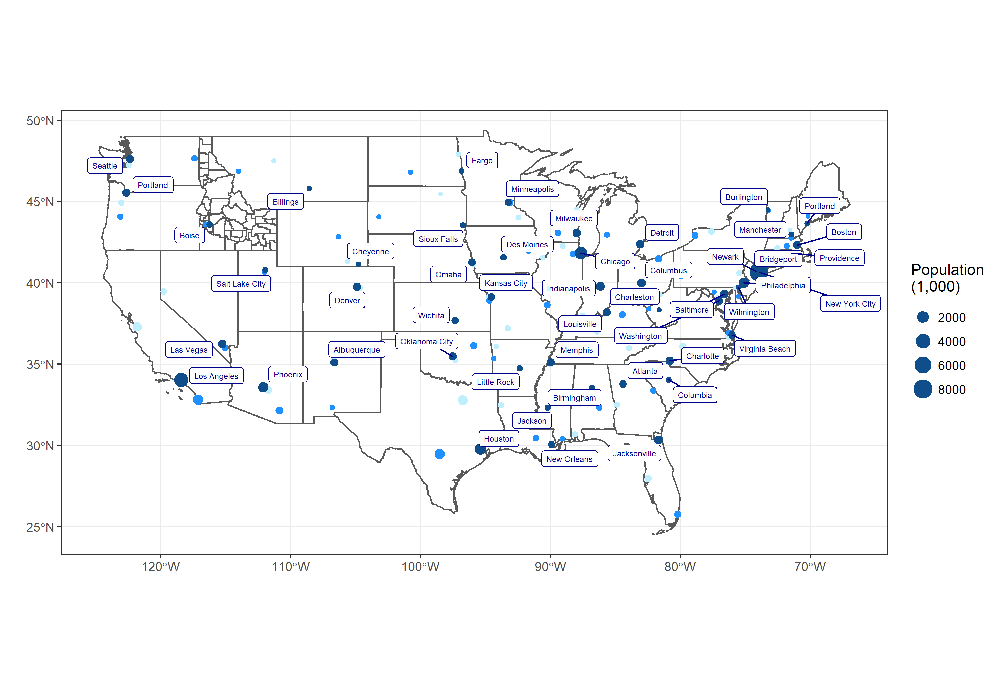

---
params:
  dtype: details
  ptitle: TRUE
  pbackground: TRUE
  number: 19
  taskname: "task-19"
output:
  html_document:
    keep_md: true
---

```{r child="task_details_format.Rmd"}

```

## Image

