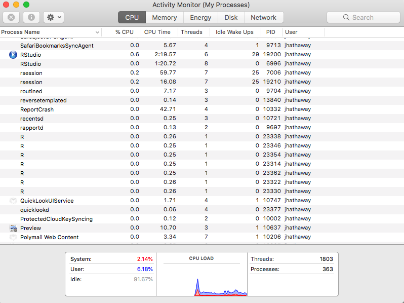

## Loading the Library and Cores

The `library(parallel)` package is the typical way to use all of your cores with R.  The package comes installed with your R. I used the predecessor packages called `library(snow)` and `library(snowfall)`.  They are still available and may be good options. In fact, I may go to them instead of `library(parallel)` even now. More recently, the `library(furrr)` package has really impressed me.  I have created a [parallel (no pun intended) example](parallel_furrr.html) using the `library(purrr)` package.


```r
library(parallel)
```

Now we need to set up our computer and R environment to leverage our processors.  

1. First we want to get our 'cluster' working with one less core than we have.  It is always a good rule to leave an available processor for the other software on your computer to use.
2. Then we initiate the cluster.


```r
# Calculate the number of cores
no_cores <- detectCores() - 1
 
# Initiate cluster
cl <- makeCluster(no_cores)
```

3. Now open your task manager (Windows) or Activity Monitor (Mac) and check to see the multiple instances of R that are now running.



## Setting up the Cores

We now need to use the `clusterExport()` function to pass the objects from or main environment to each one of the 'R' cores/sessions.  

1. First, we create the objects we will need on each core in our main environment.
2. Then we pass each object to the processes using the `varlist` variable in `clusterExport()`.
3. We also should make sure the packages are loaded using `clusterEvalQ()`


```r
# load libraries
library(tidyverse)
clusterEvalQ(cl, library(tidyverse))

#devtools::install_github("hathawayj/buildings")
library(buildings) # remember that the 'permits' data object is created when the library is loaded.
a <- 4
ff <- function(x){
  for (i in 1:1000){
    i
  }
  
  ggplot() + geom_point(x = permits[x, "value"])
  }

clusterExport(cl, varlist = c("a", "ff", "permits"))
```

Using the `clusterExport()` is important.  We want to push the things we need but we should not push to many things as each process is taking memory.  The [Win-Vector Blog](http://www.win-vector.com/blog/2016/01/parallel-computing-in-r/) showed this video to depict what tends to happen.

<iframe width="760" height="515" src="https://www.youtube.com/embed/7u4leYOhKIs" frameborder="0" allow="autoplay; encrypted-media" allowfullscreen></iframe>


## Understanding `lapply()` and `parLapply()`

Now the magic works best when we think with list objects.


```r
list_object <- as.list(1:7500)

system.time(temp1 <- lapply(list_object, ff))
system.time(temp2 <- parLapply(cl, list_object, ff))
```

Finally, when we are done running our script, we need to stop the cluster.


```r
stopCluster(cl)
```


