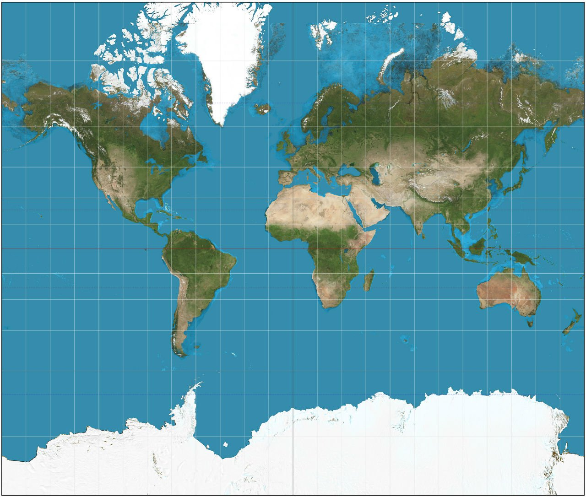
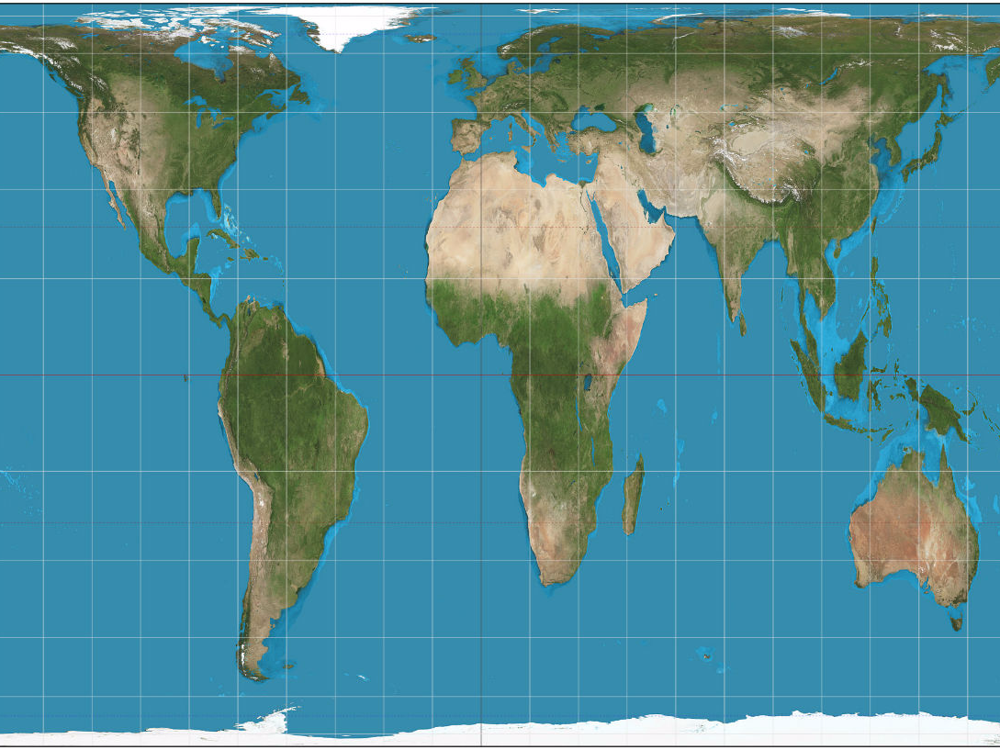
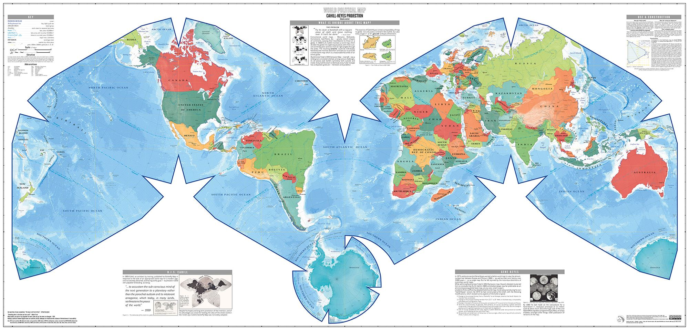

# Becoming the Critic.


```r
vday <- params$day - 1
vlink <- paste0("http://www.perceptualedge.com/example", vday, ".php")
titlelink <- paste0('{data-background-iframe="', vlink, '"}')
```


# Team Discussion


## Case Study 9: Interacting with time

> - The [Google spreadsheet link](https://docs.google.com/spreadsheets/d/1MQtkBWuxla9wITp0BzUTCjbmlvi9j9EiDLIXw7K3UBE/edit?usp=sharing)
> - [Case Study 9](https://byuistats.github.io/M335/weekly_projects/cs09_details.html)
> - [How did we do?](https://github.com/BYUI335/hathaway)


## Case Study 10: Building the past
> - [Case Study 10](https://byuistats.github.io/M335/weekly_projects/cs10_details.html)


## Task 19: Spatial Data and Measure Data
> - [Task 19](https://byuistats.github.io/M335/class_tasks/task19_details.html)


# Geospatial Data

## What is GDAL?

The Geospatial Data Abstraction Library (GDAL) is a C/C++ geospatial data format translation programming library and associated set of utility programs built using the library. GDAL is one of the jewels of the open source community, and I want to help you understand how to leverage its power to process spatial data. 

https://en.wikipedia.org/wiki/GDAL
http://www.gdal.org

## Is the earth flat?

<blockquote class="twitter-video" data-lang="en"><p lang="en" dir="ltr">Kyrie Irving was trending on Twitter today because he believes the Earth is flat. I asked him about it. <a href="https://t.co/ODe9aP9qmK">pic.twitter.com/ODe9aP9qmK</a></p>&mdash; Arash Markazi (@ArashMarkazi) <a href="https://twitter.com/ArashMarkazi/status/832770937078571008?ref_src=twsrc%5Etfw">February 18, 2017</a></blockquote>
<script async src="https://platform.twitter.com/widgets.js" charset="utf-8"></script>

## Do people believe him?

<blockquote class="twitter-video" data-lang="en"><p lang="en" dir="ltr">Uh oh: Draymond is a Flat Earth/Kyrie Truther. <a href="https://t.co/icJThyG7hx">pic.twitter.com/icJThyG7hx</a></p>&mdash; The Crossover (@TheCrossover) <a href="https://twitter.com/TheCrossover/status/833014995583643649?ref_src=twsrc%5Etfw">February 18, 2017</a></blockquote>
<script async src="https://platform.twitter.com/widgets.js" charset="utf-8"></script>

https://www.boston.com/sports/boston-celtics/2017/08/23/heres-why-kyrie-irving-thinks-the-earth-is-flat

## Which area is larger - The continental 48 states or the country of Brazil?

- While a few basketbal players may think the earth is flat, is education feeding us stuff that isn't true?
- [Boston has concerns about our map education](https://www.theguardian.com/education/2017/mar/19/boston-public-schools-world-map-mercator-peters-projection)

## What are projections?

* **Which map is correct?**
* **Which map shows area correctly?**

{ width=40% } { width=45% } 

## When we make a map, what is our goal?

* { width=90% }
* The [cahill-keyes projection looks pretty good](https://xkcd.com/977/).

## Convert to another projection

> * Take a minute and look up projections that you like and get your Task 19 graphic into that projection - http://proj4.org/projections/index.html
> * http://proj4.org/parameters.html
>     * +lon_0     Central meridian
>     * +lat_0     Latitude of origin
> * [Class activity](../spatial_class.html) 
>     * http://www.progonos.com/furuti/MapProj/Normal/ProjTbl/projTbl.html
>     * http://spatialreference.org/ref/

# Class Discussion

## Task 20 Question

Write out in a sentence what this code is doing. Make sure to catch the key points in your sentence


## Posting Comments on Class Case Studies

Why are we making comments on other's work?

[My example](https://github.com/BYUI335/Pyeatt_A/issues/7) for discussion.

## Tracking Progress

> - Don't forget to keep track of your tasks.
> - Semester project should be moving along.
> - Check out week 13 work and make sure you are working on this.

## Semester Project Discussion

Please make your own issue right now.

> - Use my issue as a starting point - <https://github.com/BYUI335/hathaway/issues/16>.
> - Create a new folder in your repository that is called `semester_project`.
> - If you would like to alter the project, then post a comment to the semester project issue with your update.
> - Call me out and ask me to review and approve changes.

