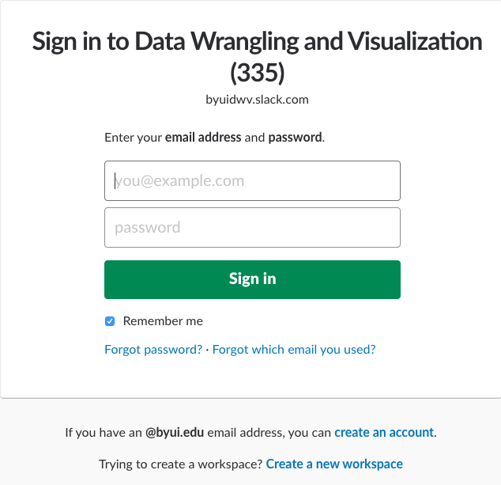

# Becoming the Critic. {data-background=#e8d725}


```r
vday <- params$day - 1
vlink <- paste0("http://www.perceptualedge.com/example", vday, ".php")
titlelink <- paste0('{data-background-iframe="', vlink, '"}')
```

## {data-background-iframe="http://www.perceptualedge.com/example1.php"}

[Visualization of the Day](http://www.perceptualedge.com/example1.php)

# The skill of debugging? {data-background=#e8d725}

## Fix the errors

At your tables note the errors in the following code and then write the fix on the board.


```r
library(tidyverse)

ggplot(dota = mpg) + 
  geom_point(mapping = aes(x = displ, y = hwy))

fliter(mpg, cyl = 8)
filter(diamond, carat > 3)
data.frame(1:10,10:1,)
```

## Interpret these error statements

Take some time at your table to work out what the error statement is saying `good and bad` about your code. Write a sentence for each of these.


```r
ggplot(dota = mpg) + 
+   geom_point(mapping = aes(x = displ, y = hwy))
#> Error in structure(list(data = data, layers = list(), 
#> scales = scales_list(),  : 
#>  argument "data" is missing, with no default
```


```r
fliter(mpg, cyl = 8)
#> Error in fliter(mpg, cyl = 8) : could not find function "fliter"
```


```r
filter(diamond, carat > 3)
#> Error in filter(diamond, carat > 3) : object 'diamond' not found
```


```r
data.frame(1:10,10:1,)
#> Error in data.frame(1:10, 10:1, ) : argument is missing, with no default
```


## Alan Perlis

> There are two ways to write error-free programs; only the third one works.

https://www.r-bloggers.com/common-r-programming-errors-faced-by-beginners/

## Manuevering in R

- Make sure you note what `Alt + Shift + K` does?
- [Socrative Team Competition](https://socrative.com/){target="blank"}

## Learning and Debugging in the wild

> - Treating class like a team meeting
> - The expense of training and experts in the real world


## R-Lab and Stack Overflow Channel

> - TA Introduction 
> - R-Lab: STC 361 [https://byuistats.github.io/M335/lab.html]
> - Online lab: Stack Overflow and Slack
>     - <https://stackoverflow.com/c/byui/join>

## Slack Workspace

> - <https://slack.com/signin> - byuidwv
>    - Click *'create and account'* towards the bottom



# Upcoming Work {data-background=#e8d725}

## Critiquing Visualizations and Slack Setup

Please read the case study that is due this Saturday with your group and make sure your table understands the deliverables and has a good picture of how to complete them.

> - [Case Study 1](https://byuistats.github.io/M335/weekly_projects/cs01_details.html)

<span style="font-size:75px">
Questions?
</span>

## Task 2: Wax on, Wax off with Swirl

> - [Task 2](file:///C:/git/github/byuistats/M335/docs/class_tasks/task02_details.html)
> - [Submit GitHub usernames](https://docs.google.com/spreadsheets/d/13aQsQYnGTQXyyBUGzE1V9MExEvG5woAmygtkdjltdjk/edit#gid=59053514)


## Data Science Jobs

- [What a data scientist is not.](https://www.youtube.com/embed/iQBat7e0MQs?rel=0&amp;start=220)
- [What is the life cycle of a data science project?](https://www.youtube.com/embed/iQBat7e0MQs?rel=0&amp;start=375)
    - Demand for deep analytical talent in the U.S. projected to be 50-60% greater than supply by 2018, leading to a shortage of 140,000 to 190,000 people as well as 1.5 million managers and analysts.


