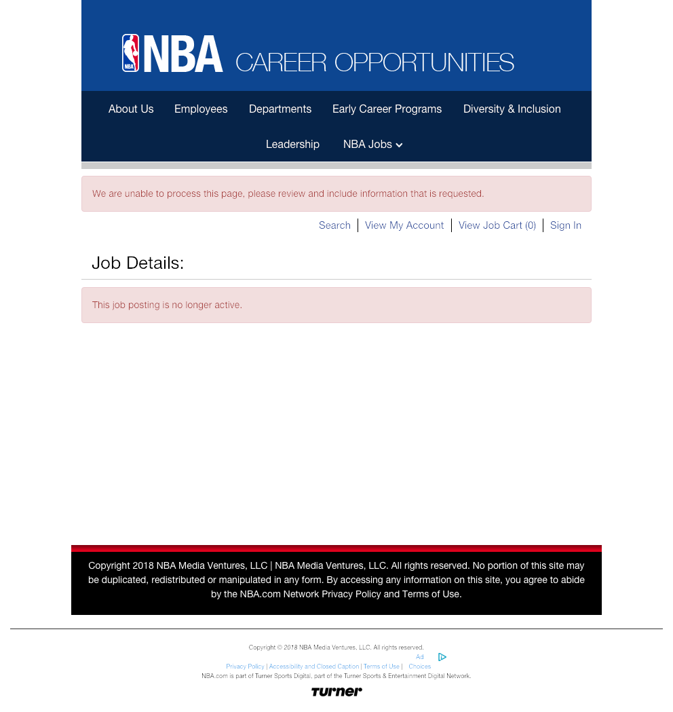

# Team Discussion

## Case Study 10: Building the past

> - The [Google spreadsheet link](https://docs.google.com/spreadsheets/d/1MQtkBWuxla9wITp0BzUTCjbmlvi9j9EiDLIXw7K3UBE/edit?usp=sharing)
> - [Case Study 10](https://byuistats.github.io/M335/weekly_projects/cs10_details.html)
> - [How did we do?](https://github.com/BYUI335/hathaway)

## Case Study 11: Interacting with space
> - [Case Study 11](https://byuistats.github.io/M335/weekly_projects/cs11_details.html)

## Task 21: Interactive Maps
> - [Task 21](https://byuistats.github.io/M335/class_tasks/task21_details.html)

## Latest Jobs Discussion

https://careers.peopleclick.com/careerscp/client_nba/external/jobDetails.do?functionName=getJobDetail&jobPostId=7818&localeCode=en-us

# Finishing the Semester

## Semester Project Discussion

> - [Semester project](https://byuistats.github.io/M335/project.html)
> - ["Your flavor of .Rmd"](http://rmarkdown.rstudio.com/formats.html)

## Tracking Progress

> - Don't forget to keep track of your tasks.
> - Semester project should be moving along.
> - Check out week 13 work and make sure you are working on this.

## Completing your portfolio

Weeks 12 and 13 are going to take some work and will be the most rewarding of the class.  I am expecting that you will put in the time to make these parts of the class productive.

> - [Week 13](https://byuistats.github.io/M335/weekly_projects/cs13_details.html)

# Maps

## Selecting the Display

*A wise and noble Wizard, Albus Dumbledore once said,* **“It is our choices, Harry, that show what we truly are, far more than our abilities.”**

> - [Here is my Task 21 and Case Study 11](https://shiny.byui.edu/connect/#/apps/106/access)
> - [Firefly Cartography](https://adventuresinmapping.com/2016/10/17/firefly-cartography/)

Read through the following article at your table and take notes in your README.md for today about the 4 stratagies for displaying map data.

- [Spatial Data Often becomes big data](https://blogs.esri.com/esri/arcgis/2017/10/17/strategies-to-effectively-display-large-amounts-of-data-in-web-apps/)

## Leaflet Extras

Read through the [Leaflet guide](https://rstudio.github.io/leaflet/) and find 1-2 additional map features you could add to your last task.

## Project Time
