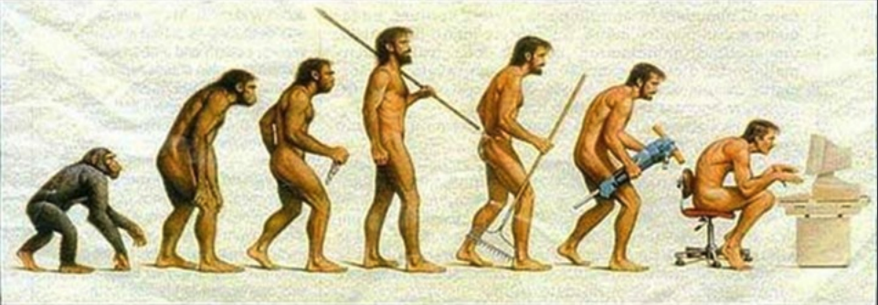

```{r setup, include=FALSE}
knitr::opts_chunk$set(echo = TRUE, message = FALSE, warning = FALSE)

if (params$day %% 2 == 0) md_intro_format <- "even_intro_format.Rmd"
if (params$day %% 2 == 1) md_intro_format <- "odd_intro_format.Rmd"

```

```{r child=md_intro_format}

```


# Discussing the Art

## Tools

Learning to properly use tools empowers us to make change.



## The 8-fold path

1. Simplify
2. Explore
3. Compare
4. Attend
5. View diversely
6. Respond
7. Be skeptical
8. Ask why

## Compare

The primary question of analysis is "Compared to what?"

- Tufte

## Attend

We need to make graphics that allow people to attend to the elements that matter

http://viscoglab.psych.ubc.ca/videos/


