# Exploratory Data Analysis
J. Hathaway  


# Week 2 Review

## Task 5

Please go to a white board and write down the necessary lines of code to read in the data from the website to the console and in your `.rmd` file.

* What is the difference between `read.csv()` and `read_csv()`
* Read [this link](https://csgillespie.github.io/efficientR/5-3-importing-data.html) and take some time to make a note in your repository about the benefits.

## Case Study 2

* [Reveiw Class Work](https://github.com/BYUI335/hathaway/issues)

## Git, GitHub, and R-Studio

How are we doing with files and folder structures - [Git reading](https://byuistats.github.io/M335/git_335.html)

* Take a few minutes to make sure we all have the same structure.

## Slack, GitHub issues, and communication

* Remember there is no `dumb` question.  
    * However, always check to see if your question has already been answered.

* How is slack working?
    * Threaded conversations
    * Two channels for help?

* GitHub issue vs Slack post
    * [class_public](https://github.com/BYUI335/class_public/issues)
    * [slack post](https://slack.com/)

* Quick help vs detailed support
* Questions vs Issues


# What is EDA?

## Exploratory Data Analysis

EDA is fundamentally a creative process. And like most creative processes, the key to asking quality questions is to generate a large quantity of questions.
 
> 1. What type of variation occurs within my variables?

> 2. What type of covariation occurs between my variables?

# Exploring Old Faithful

## Exploring Old Faithful goals

> 1. **Make the [histogram shown in the book](http://r4ds.had.co.nz/EDA_files/figure-html/unnamed-chunk-9-1.png) with the black and white theme and an improved x-axis label.**

## Exploring Old Faithful (1)


```r
faithful %>%
  ggplot(aes(x = eruptions)) + 
    geom_histogram(color = "white") +
    theme_bw() +
    labs(x = "Duration of eruption (minutes)", 
         y = "Number of Observations")
```

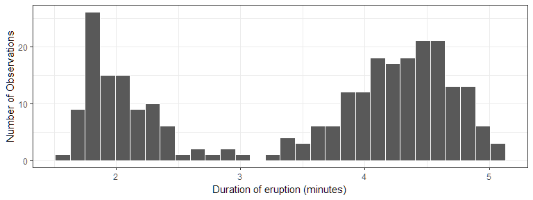

## Exploring Old Faithful goals

> 1. Make the [histogram shown in the book](http://r4ds.had.co.nz/EDA_files/figure-html/unnamed-chunk-9-1.png) with the black and white theme and an improved x-axis label.
> 2. **Use the mutate function to modify our plot to fill the histogram for two groups of waiting times.**


```r
mutate(waiting_group = case_when(waiting < 67 ~ " < 67 min",
                                   waiting >= 67 ~ " > 67 min"))
```

## Exploring Old Faithful (2)


```r
faithful %>%
  mutate(waiting_group = case_when(waiting < 67 ~ " < 67 min",
                                   waiting >= 67 ~ " > 67 min")) %>%
  ggplot(aes(x = eruptions, fill = waiting_group)) + 
    geom_histogram(color = "white") +
    scale_fill_brewer(type = "qual") +
    theme_bw() + theme(legend.position = "bottom") +
    labs(x = "Duration of eruption (minutes)", 
         fill = "Duration\nof Wait", y = "Number of Observations")
```

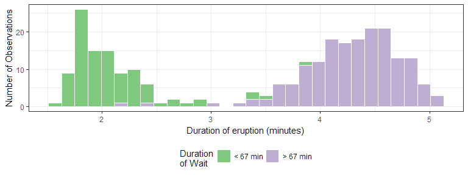

## Exploring Old Faithful goals

> 1. Make the [histogram shown in the book](http://r4ds.had.co.nz/EDA_files/figure-html/unnamed-chunk-9-1.png) with the black and white theme and an improved x-axis label.
> 2. Use the mutate function to modify our plot to fill the histogram for two groups of waiting times.


```r
mutate(waiting_group = case_when(waiting < 67 ~ " < 67 min",
                                   waiting >= 67 ~ " > 67 min"))
```

> 3. **Use the wating variable to make a hexbin plot of the relationship between waiting time and duration.**


## Exploring Old Faithful (3)


```r
faithful %>%
ggplot(aes(x = eruptions, y = waiting)) + 
  geom_hex() + theme_bw() +
  labs(x = "Duration of eruption (minutes)", 
       y = "Time between eruptions (minutes)", 
       fill = "Number of\nObservations")
```

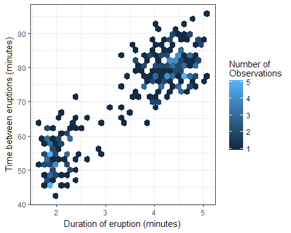

# Understanding terms

## Socrative Quiz

> - [Socrative: Exploratory Analysis](https://socrative.com/)

# Displaying multiple distributions

## Clarity vs. Complication

Data can get complicated very fast. How do we provide depth of variability understanding without overwhelming the visualization user?

* [violin plots](http://eamoncaddigan.net/dataviz/r/psych/2015/09/26/violin-plots/)
* [beeswarm plots](https://github.com/eclarke/ggbeeswarm)
* [letter-value boxplots](https://github.com/hadley/lvplot)

Another package that makes flipping the axes easier in ggplot -- [rotating axes](https://github.com/lionel-/ggstance)

The remaining slides are draft.


## Histograms (1)

What don't we like about this plot?


```r
library(nycflights13)
library(tidyverse)
library(magrittr)
# plot code for histograms

flights %>% 
    ggplot(aes(x = dep_delay)) +
    facet_wrap(~carrier) +
    geom_histogram(bins = 150, color = "white") +
    coord_cartesian(xlim = c(-50, 250)) +
    theme_bw()
```

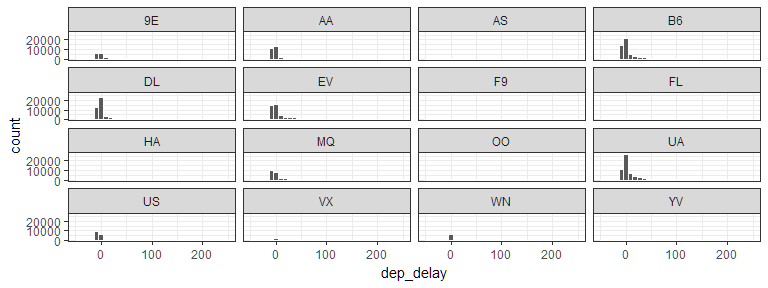


## Histograms (2)

* What changed in this histogram?
* What don't we like about this plot?


```r
# plot code for histograms

flights %>% 
    ggplot(aes(x = dep_delay)) +
    facet_wrap(~carrier, scales = "free_y") +
    geom_histogram(bins = 150, color = "white") +
    coord_cartesian(xlim = c(-50, 250)) +
    theme_bw()
```

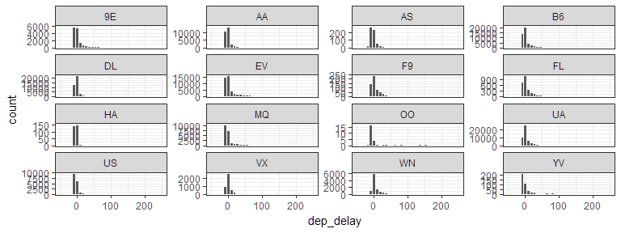


## Boxplots

* What don't we like about this plot?
* How hard is it to explain?


```r
gg_base <- flights %>%
  ggplot(aes(x = carrier, y = dep_delay)) +
    coord_cartesian(ylim = c(-50, 250)) +
    theme_bw()
# Now add varied distribution geoms

gg_base + geom_boxplot() 
```

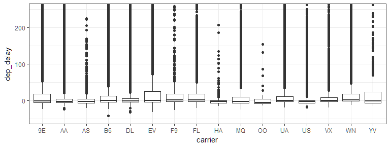


## Violin plots

* What don't we like about this plot?
* How hard is it to explain?


```r
# Now add varied distribution geoms
gg_base + geom_violin()
```

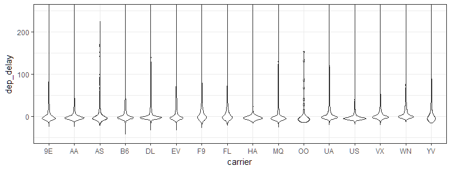


## Beeswarm plots (1)

* What don't we like about this plot?
* How hard is it to explain?


```r
# Now add varied distribution geoms
library(ggbeeswarm)
gg_base + geom_quasirandom(alpha = .6, size = .75)
```

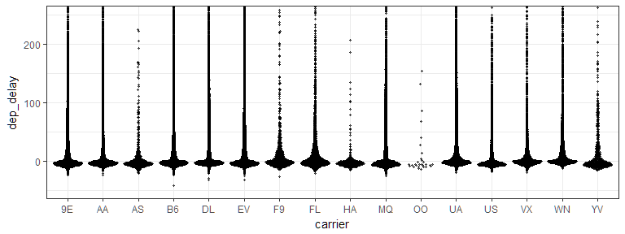

## Beeswarm plots (1)

* What don't we like about this plot?
* How hard is it to explain?


```r
# Now add varied distribution geoms
library(ggbeeswarm)
gg_base + geom_quasirandom(alpha = .6, size = .75) + 
  coord_cartesian(ylim = c(-50, 500)) 
```

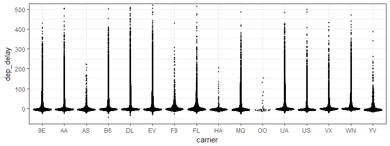

## Letter-Value boxplots (1)

* What don't we like about this plot?
* How hard is it to explain?


```r
# Now add varied distribution geoms
library(lvplot)
gg_base + geom_lv(aes(fill = ..LV..)) + scale_fill_lv()
```

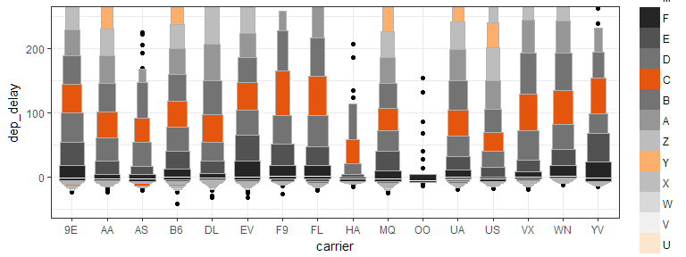

## Letter-Value boxplots (2)

* What don't we like about this plot?
* How hard is it to explain?


```r
# Now add varied distribution geoms
library(lvplot)
gg_base + geom_lv(aes(fill = ..LV..)) + 
  scale_fill_lv() + 
  coord_cartesian(ylim = c(-50, 500)) 
```

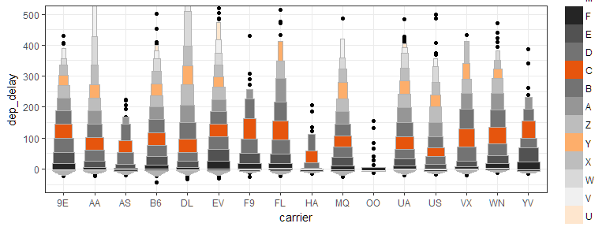

## Letter-Value boxplots (3)

* What don't we like about this plot?
* How hard is it to explain?


```r
# Now add varied distribution geoms
library(lvplot)
gg_base + geom_lv(aes(fill = ..LV..)) + 
  scale_fill_lv() + 
  coord_cartesian(ylim = c(-50, 1500)) 
```

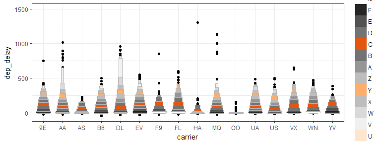
