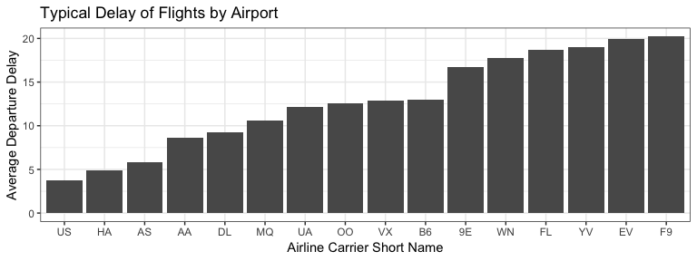
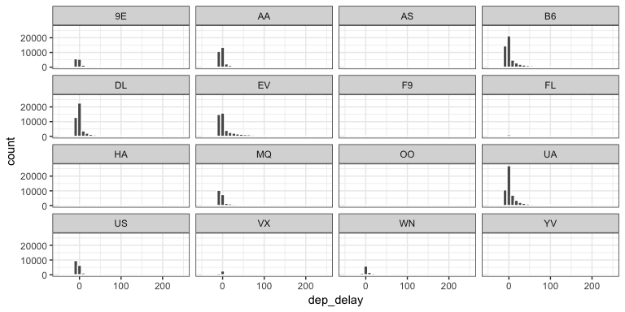
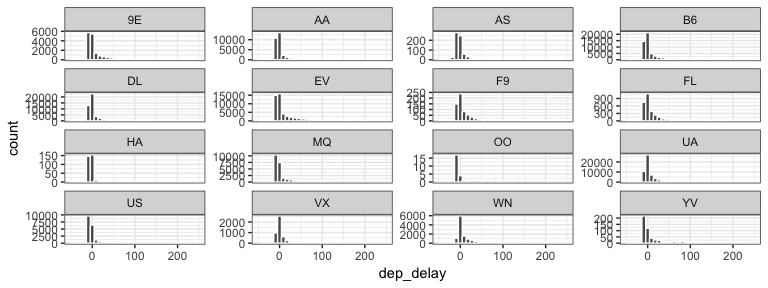
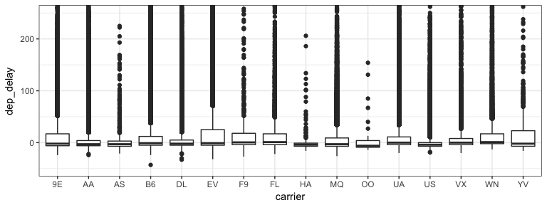
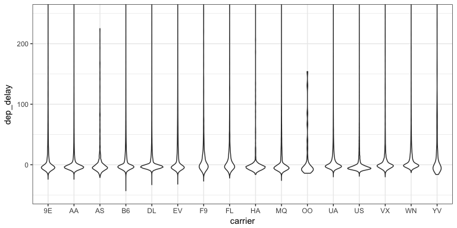
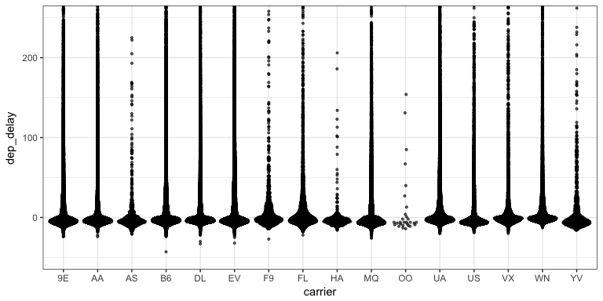
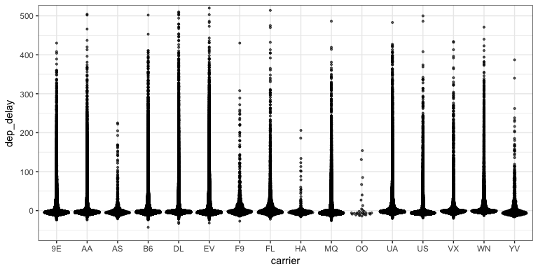
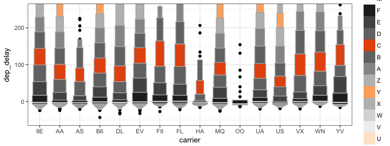
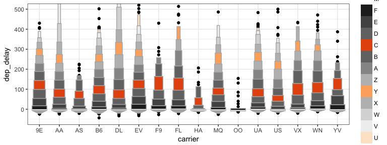
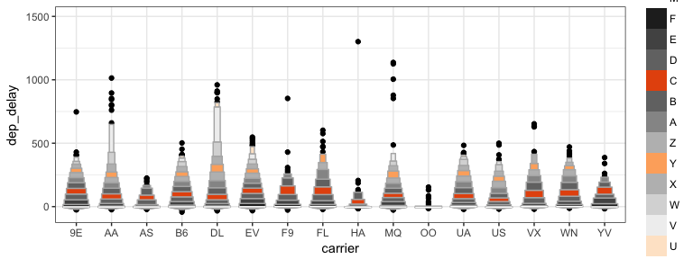

# Great Quotes

## Hans

**It is only by measuring that we can cross the river of myths.**

> - [Hans Rosling](https://youtu.be/OwII-dwh-bk)

# Becoming the Critic.


```r
vday <- params$day - 1
vlink <- paste0("http://www.perceptualedge.com/example", vday, ".php")
titlelink <- paste0('{data-background-iframe="', vlink, '"}')
```

## {data-background-iframe="http://www.perceptualedge.com/example4.php"}

[Visualization of the Day](http://www.perceptualedge.com/example4.php)


## My Attempt at a graphic


# Team Discussion


## Case Study 2: Wealth and Life Expectancy (Gapminder)

> - The [Google spreadsheet link](https://docs.google.com/spreadsheets/d/1MQtkBWuxla9wITp0BzUTCjbmlvi9j9EiDLIXw7K3UBE/edit?usp=sharing)
> - [Case Study 2](https://byuistats.github.io/M335/weekly_projects/cs02_details.html)
> - [How did we do?](https://github.com/BYUI335/hathaway)


## Case Study 3: Becoming a databender
> - [Case Study 3](https://byuistats.github.io/M335/weekly_projects/cs03_details.html)


## Task 5: Making bad graphics
> - [Task 5](https://byuistats.github.io/M335/class_tasks/task05_details.html)


## Github Activity

> * [Watching Class Activity](https://github.com/BYUI335/M335_HathawayJ/issues/15)


## Virtual Questions and Support

* How is slack working?
    * Threaded conversations
    * Two channels for help?

* Stack Overflow vs Slack post
    * [Stack Overflow BYUI](https://stackoverflow.com/c/byu/join)
    * [slack post](https://slack.com/)

* Quick help vs detailed support

# The Graphic Tool Set

## The grammar of graphics

> - [An overview of the grammar](https://www.youtube.com/embed/uiTc55clwuA?rel=0)
> - [ggplot2 specifics](https://www.youtube.com/embed/PiY9hwOkL8U?rel=0)

## Cleveland's Examples

There were three democratic candidates.  We are going to use the following plots to help us understand the constituency that helped the winner in the primaries.

- [1984 Primaries](https://en.wikipedia.org/wiki/Democratic_Party_presidential_primaries,_1984)
- [Mondale, Hart, Jackson Visualization](../images/Cleveland_1_ok.png){target="blank"}
- [Better Mondale, Hart, Jackson Visualisation](../images/Cleveland_1_better.png){target="blank"}
- How much time do you think it took Bill Cleveland in th 80's to make each graph?

## Class Activity: Getting Started


Get the above code working.  We will be tweaking it using ggplot for the next part.

## Labelling the outside

Complete the following - **Create clean labels for the x and y axes and zoom in on the y-axis from 50 to 100 minutes. Also have breaks every 15 minutes**

> * labelling - Axes, Titles, and Legends

> * xy Scales - `scale_x_`, `scale_y`, `coord_`
>    * Setting breaks and changing labels
>    * Transforming scale


## Labelling the inside

Complete the following - **1) Color the points of `fl_sc` by `origin` using the brewer scale. 2) Color the points of `fl_sc` by `arr_delay`**

> * Annotations - Marking points
> * color & fill scales
>    * `scale_color_`
>    * `scale_fill_`
>    * `scale_gradient_`


## Putting the legend on the inside

Complete the following - **1) Color the points of `fl_sc` by `origin` using the brewer scale and use the directlabel package to move the labels into the plotting region.**

> * `library(directlabels)`
>    * http://directlabels.r-forge.r-project.org/examples.html
>    * `geom_dl()` and `direct.label()`


## Changing the feel

Complete the following - **Use a `theme_() to create a different look for your graphic and change the orientiation of the x-axis test to 35 degrees**


> * Themes (check out `library(ggthemes)`)
> * `ggsave()`


# Displaying distributions of multiple groups for decision making

## Clarity vs. Complication

> - What do we know after looking at this plot?
> **How do we provide depth of variability understanding without overwhelming the visualization user?**





Remember, data can get complicated very fast. 


## Distribution background

* [violin plots](http://eamoncaddigan.net/dataviz/r/psych/2015/09/26/violin-plots/)
* [beeswarm plots](https://github.com/eclarke/ggbeeswarm)
* [letter-value box-plots](https://github.com/hadley/lvplot)

Another package that makes flipping the axes easier in ggplot -- [rotating axes](https://github.com/lionel-/ggstance)


## Histograms (1)

What don't we like about this plot?




## Histograms (2)

* What changed in this histogram?
* What don't we like about this plot?




## Boxplots

* What don't we like about this plot?
* How hard is it to explain?




## Violin plots

* What don't we like about this plot?
* How hard is it to explain?




## Beeswarm plots (1)

* What don't we like about this plot?
* How hard is it to explain?



## Beeswarm plots (1)

* What don't we like about this plot?
* How hard is it to explain?



## Letter-Value boxplots (1)

* What don't we like about this plot?
* How hard is it to explain?



## Letter-Value boxplots (2)

* What don't we like about this plot?
* How hard is it to explain?



## Letter-Value boxplots (3)

* What don't we like about this plot?
* How hard is it to explain?


