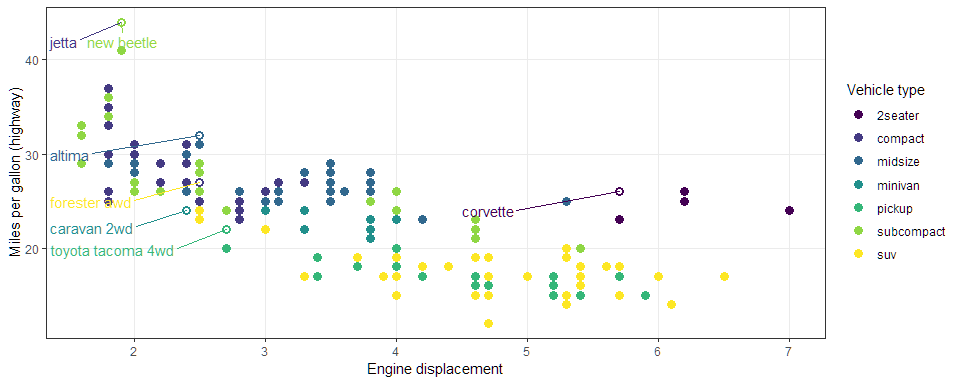

<<<<<<< HEAD
# Becoming the Critic. {data-background=#e8d725}
=======
# Becoming the Critic.
>>>>>>> 3555fbbcd42e43308a527a106f7c819389108e06


```r
vday <- params$day - 1
vlink <- paste0("http://www.perceptualedge.com/example", vday, ".php")
titlelink <- paste0('{data-background-iframe="', vlink, '"}')
```

## {data-background-iframe="http://www.perceptualedge.com/example4.php"}

[Visualization of the Day](http://www.perceptualedge.com/example4.php)


## My Attempt at a graphic


## Virtual Questions and Support

<<<<<<< HEAD
* How is slack working?
    * Threaded conversations
    * Two channels for help?
=======
# Being Readings

# How does data change belief?

## To understand God's thoughts we must study statistics, for these are the measure of His purpose.

-Florence Nightingale ([Coxcomb graph](https://en.wikiquote.org/wiki/Florence_Nightingale#/media/File:Nightingale-mortality.jpg))

<small>
Her most famous graph, displayed at the top of this article, shows the number of soldier deaths per month from various causes. Each pie slice represents a different month, from April 1854 through March 1856, and each color stands for a different cause of death. It takes just a quick glance to achieve the two main takeaways: that disease, colored blue, killed far more soldiers than either "wounds" (red) or "other" (black), and that it was reduced greatly in 1855.
</small>

## What changed Britian's mind?

After she completed her report, Nightingale worked hard to turn its conclusions into common knowledge, privately distributing it to influential people and writing several more reports, many of which included coxcombs. When she received push back from Army doctors, who thought sanitary measures a waste of money, she even leaked some of her charts to the press.

## Hans

**It is only by measuring that we can cross the river of myths.**

> - [Hans Rosling](https://youtu.be/OwII-dwh-bk)


>>>>>>> 3555fbbcd42e43308a527a106f7c819389108e06

* Stack Overflow vs Slack post
    * [Stack Overflow BYUI](https://stackoverflow.com/c/byu/join)
    * [slack post](https://slack.com/)

* Quick help vs detailed support


## Getting the Routine Down

- **I am expecting pushes to happen at least three times a week**
- [Leadership Task](https://byuistats.github.io/M335/tasklist.html)

## Review the reading

Write this chunk of code out in an English sentence to your grandma.


```r
best_in_class <- mpg %>%
  group_by(class) %>%
  filter(row_number(desc(hwy)) == 1)
```


# Being Readings {data-background=#e8d725}

## How does data change belief?

## To understand God's thoughts we must study statistics, for these are the measure of His purpose.

-Florence Nightingale ([Coxcomb graph](https://en.wikiquote.org/wiki/Florence_Nightingale#/media/File:Nightingale-mortality.jpg))

<small>
Her most famous graph, displayed at the top of this article, shows the number of soldier deaths per month from various causes. Each pie slice represents a different month, from April 1854 through March 1856, and each color stands for a different cause of death. It takes just a quick glance to achieve the two main takeaways: that disease, colored blue, killed far more soldiers than either "wounds" (red) or "other" (black), and that it was reduced greatly in 1855.
</small>

## What changed Britian's mind?

After she completed her report, Nightingale worked hard to turn its conclusions into common knowledge, privately distributing it to influential people and writing several more reports, many of which included coxcombs. When she received push back from Army doctors, who thought sanitary measures a waste of money, she even leaked some of her charts to the press.

## Hans

<<<<<<< HEAD
**It is only by measuring that we can cross the river of myths.**
=======
## Task 5: World Data Investigation
> - [Task 5](https://byuistats.github.io/M335/class_tasks/task05_details.html)
>>>>>>> 3555fbbcd42e43308a527a106f7c819389108e06

> - [Hans Rosling](https://youtu.be/OwII-dwh-bk)


<<<<<<< HEAD


# Team Discussion {data-background=#e8d725}
=======
## Virtual Questions and Support
>>>>>>> 3555fbbcd42e43308a527a106f7c819389108e06


## Case Study 2: Wealth and Life Expectancy (Gapminder)

> - The [Google spreadsheet link](https://docs.google.com/spreadsheets/d/1MQtkBWuxla9wITp0BzUTCjbmlvi9j9EiDLIXw7K3UBE/edit?usp=sharing)
> - [Case Study 2](https://byuistats.github.io/M335/weekly_projects/cs02_details.html)
> - [How did we do?](https://github.com/BYUI335/hathaway)


## Case Study 3: Becoming a databender
> - [Case Study 3](https://byuistats.github.io/M335/weekly_projects/cs03_details.html)


<<<<<<< HEAD
## Task 5: World Data Investigation
> - [Task 5](https://byuistats.github.io/M335/class_tasks/task05_details.html)
=======
```r
#install.packages("nycflights13")
library(nycflights13)

fl_bp <- flights %>%
  ggplot(aes(x = carrier, y = dep_delay))
fl_sc <- flights %>%
  filter(dep_time > 800, dep_time < 900) %>%
  ggplot(aes(x = dep_time, y = dep_delay))

fl_bp + geom_boxplot()
fl_sc + geom_point()
```
>>>>>>> 3555fbbcd42e43308a527a106f7c819389108e06


<<<<<<< HEAD


=======
Complete the following - **Create clean labels for the x and y axes and zoom in on the y-axis from 50 to 100 minutes. Also have breaks every 15 minutes**
   
> - labelling - Axes, Titles, and Legends
> - xy Scales - `scale_x_`, `scale_y`, `coord_` - Setting breaks and changing labels *or* Transforming scale
>>>>>>> 3555fbbcd42e43308a527a106f7c819389108e06


# Data Ingestion {data-background=#e8d725}

<<<<<<< HEAD

## Data formats
=======
Complete the following - 

> 1. Color the points of `fl_sc` by `origin` using the brewer scale. 
> 2. Color the points of `fl_sc` by `arr_delay`**

> - color & fill scales   
>     - `scale_color_`
>     - `scale_fill_`
>     - `scale_gradient_`
>>>>>>> 3555fbbcd42e43308a527a106f7c819389108e06

If there is a data format that exists and is used, then there is a way to import that data into R. We will learn how to handle the basic tabular formats.  The packages `library(readr)`, `library(readxls)`, and `library(haven)` will provide most of the functionality we need.

## Understanding file types

* What is an [ASCII](https://www.webopedia.com/TERM/A/ASCII_file.html) file?
* Which of the following file formats are not ASCII?
    * `.csv`
    * `.html`
    * `.txt`
    * `.R`
    * `.xlsx`
    * `.Rmd`
    * `.doc`

## Data Import (task 5)

* What is the difference between `read.csv()` and `read_csv()`
* Read [this link (5.3.1)](https://csgillespie.github.io/efficientR/5-3-importing-data.html) and take some time to make a note in your task 5 `README.md` in your repository about the benefits.
* Push your updated `README.md` for me to read in class.


## `parse_` commands

Use this code - `money <- c('4,554,25', '$45', '8025.33cents', '288f45')`

* Apply `as.numeric(money)` and talk with your table about the output.
* Apply `parse_number(money)` and compare the results.

## Using `read_csv()` with parsers

<<<<<<< HEAD

> 1. Run this line of code below
> 2. Look at the errors (`problems(challenge)`), the `head()`, and `tail()` of your `challenge` object.  What formats should they be?
> 3. Now review [11.4.2 of our textbook](http://r4ds.had.co.nz/data-import.html#problems) and fix the read in.
=======
Complete the following - **Use a `theme_()` to create a different look for your graphic and change the orientiation of the x-axis test to 35 degrees**
>>>>>>> 3555fbbcd42e43308a527a106f7c819389108e06


```r
challenge <- read_csv(readr_example("challenge.csv"))
```


## Scripts

Here are a few questions.  Discuss each one with your table and decide which file type to use - `.md`, `.r` or `.rmd`.  Then discuss the reasons for that decision.

1. I have a short memo to write for my boss that will not have any r code included.
2. I am working out some example R code to make sure I understand what it is doing ([see this for a twist](https://deanattali.com/2015/03/24/knitrs-best-hidden-gem-spin/)).
3. Brother Hathaway has some code snippets that he wants us to learn in class.
4. I have a report that I need to write which will include some writing and analysis.


# The Graphic Tool Set {data-background=#e8d725}

## The grammar of graphics

> - [An overview of the grammar](https://www.youtube.com/embed/uiTc55clwuA?rel=0)
> - [ggplot2 specifics](https://www.youtube.com/embed/PiY9hwOkL8U?rel=0)

<<<<<<< HEAD
## Cleveland's Examples

There were three democratic candidates.  We are going to use the following plots to help us understand the constituency that helped the winner in the primaries.

- [1984 Primaries](https://en.wikipedia.org/wiki/Democratic_Party_presidential_primaries,_1984)
- [Mondale, Hart, Jackson Visualization](../images/Cleveland_1_ok.png){target="blank"}
- [Better Mondale, Hart, Jackson Visualisation](../images/Cleveland_1_better.png){target="blank"}
- How much time do you think it took Bill Cleveland in th 80's to make each graph?

## Class Activity: Getting Started
=======
# Displaying distributions of multiple groups for decision making
>>>>>>> 3555fbbcd42e43308a527a106f7c819389108e06


```r
#install.packages("nycflights13")
library(nycflights13)

fl_bp <- flights %>%
  ggplot(aes(x = carrier, y = dep_delay))
fl_sc <- flights %>%
  filter(dep_time > 800, dep_time < 900) %>%
  ggplot(aes(x = dep_time, y = dep_delay))

fl_bp + geom_boxplot()
fl_sc + geom_point()
```

Get the above code working.  We will be tweaking it using ggplot for the next part.

## Labelling the outside

Complete the following - **Create clean labels for the x and y axes and zoom in on the y-axis from 50 to 100 minutes. Also have breaks every 15 minutes**
   
> - labelling - Axes, Titles, and Legends
> - xy Scales - `scale_x_`, `scale_y`, `coord_` - Setting breaks and changing labels *or* Transforming scale


<<<<<<< HEAD

## Labelling the inside
=======
* [violin plots](http://eamoncaddigan.net/dataviz/r/psych/2015/09/26/violin-plots/)
* [beeswarm plots](https://github.com/eclarke/ggbeeswarm)
* [letter-value box-plots](https://github.com/hadley/lvplot)
* Another package that makes flipping the axes easier in ggplot -- [rotating axes](https://github.com/lionel-/ggstance)
>>>>>>> 3555fbbcd42e43308a527a106f7c819389108e06

Complete the following - 

> 1. Color the points of `fl_sc` by `origin` using the brewer scale. 
> 2. Color the points of `fl_sc` by `arr_delay`**

> - color & fill scales   
>     - `scale_color_`
>     - `scale_fill_`
>     - `scale_gradient_`


## Putting the legend on the inside

Complete the following - **1) Color the points of `fl_sc` by `origin` using the brewer scale and use the directlabel package to move the labels into the plotting region.**

<<<<<<< HEAD
> * `library(directlabels)`
>    * http://directlabels.r-forge.r-project.org/examples.html
>    * `geom_dl()` and `direct.label()`

=======
## Boxplots
>>>>>>> 3555fbbcd42e43308a527a106f7c819389108e06


## Changing the feel

Complete the following - **Use a `theme_()` to create a different look for your graphic and change the orientiation of the x-axis test to 35 degrees**

> * Themes (check out `library(ggthemes)`)
> * `ggsave()`


## Scales

Each of the aesthetics has a paired scale function - x, y, size, color, fill, linetype, shape, alpha.  All of the scales start with `scale_` and then the respective aesthetic. All the aesthetic scales have an `_continuous`, `_discrete`, and `_manual`.  

> - `scale_x_` & `scale_y_` are the two scales I most often use
> - `scale_fill_` & `scale_color_` are the next most often used.
>     - manual()
>     - gradientn()

## Labelling Elements inside the graphic

The `library(ggrepel)` package is a must for our work. `library(directlabels)` can also be helpful. 
Here is the [book's graphic](http://r4ds.had.co.nz/communicate-plots_files/figure-html/unnamed-chunk-9-1.png). 

> - What are some concerns you have with this graphic?

## Code and graphic (scales)

Here is the [book's graphic](http://r4ds.had.co.nz/communicate-plots_files/figure-html/unnamed-chunk-9-1.png).  
Use the [code from 28.3](http://r4ds.had.co.nz/graphics-for-communication.html) and update their graphic to match mine.




## My Code Solution


```r
library(ggrepel)
library(viridis)

best_in_class <- mpg %>% 
  group_by(class) %>% 
  filter(row_number(desc(hwy)) == 1)

ggplot(mpg, aes(displ, hwy)) +
  geom_point(aes(colour = class), size = 3) +
  geom_point(size = 1.5, data = best_in_class, color = "white") +
  geom_text_repel(aes(label = model, colour = class), 
                  data = best_in_class, show.legend = FALSE, 
                  nudge_x = -1, nudge_y = -2) +
  theme_bw() + theme(panel.grid.minor = element_blank()) +
  scale_color_viridis(discrete = TRUE) + 
  labs(x = "Engine displacement", y = "Miles per gallon (highway)", 
       color = "Vehicle type")
```

