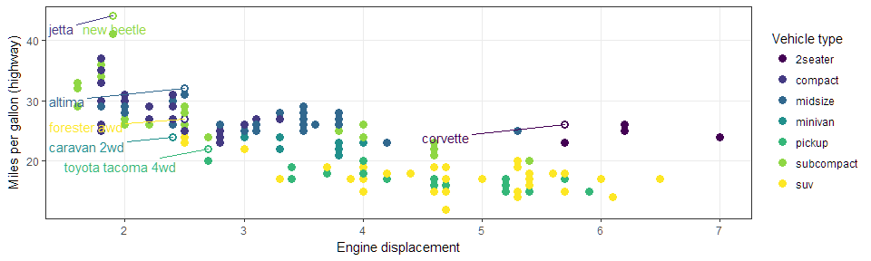

# Exploratory Data Analysis
J. Hathaway  


# Review

## Class Board Concept

Write this chunk of code out in an English sentence to your grandma.


```r
best_in_class <- mpg %>%
  group_by(class) %>%
  filter(row_number(desc(hwy)) == 1)
```

If this error was returned what does it mean?

```
Error: unexpected '=' in:
"  group_by(class) %>%
  filter(row_number(desc(hwy)) ="
```

## Getting the Routine Down

This Saturday submission finalizes the getting up to speed portion of the routine for this class. We also should be comfortable with the following

> 1. Using Git and GitHub
> 2. Using folder structure to manage projects
> 3. Completing reading

- **I am expecting pushes to happen at least three times a week**
- [Leadership Task](https://byuistats.github.io/M335/tasklist.html)

## Task 6

[World Child Mortatility](https://byuistats.github.io/M335/class_tasks/task06_details.html) visualizations.  **Who would like to highlight their work that they have pushed?**

> - [Our Classroom Group](https://github.com/BYUI335)

## Case Study 3

What questions do you all have for this case study?

> - [Understanding Deaths in the US](https://byuistats.github.io/M335/weekly_projects/cs03_details.html)

# Understanding terms

## Socrative Quiz

> - [Socrative: Exploratory Analysis](https://socrative.com/)

# New functions

## Scales

Each of the aesthetics has a paired scale function - x, y, size, color, fill, linetype, shape, alpha.  All of the scales start with `scale_` and then the respective aesthetic. All the aesthetic scales have an `_continuous`, `_discrete`, and `_manual`.  

> - `scale_x_` & `scale_y_` are the two scales I most often use
> - `scale_fill_` & `scale_color_` are the next most often used.
>     - manual()
>     - gradientn()

## Labelling Elements inside the graphic

The `library(ggrepel)` package is a must for our work. `library(directlabels)` can also be helpful. 
Here is the [book's graphic](http://r4ds.had.co.nz/communicate-plots_files/figure-html/unnamed-chunk-9-1.png). 

> - What are some concerns you have with this graphic?

## Code and graphic (scales)

Here is the [book's graphic](http://r4ds.had.co.nz/communicate-plots_files/figure-html/unnamed-chunk-9-1.png) - Code is below.  
Try to update their graphic to match mine.


```r
best_in_class <- mpg %>% group_by(class) %>% filter(row_number(desc(hwy)) == 1)
ggplot(mpg, aes(displ, hwy)) + geom_point(aes(colour = class)) + 
  geom_point(size = 3, shape = 1, data = best_in_class) + 
  ggrepel::geom_label_repel(aes(label = model), data = best_in_class)
```



## Code and Graphic Solution (scales)


```r
library(ggrepel)
ggplot(mpg, aes(displ, hwy)) +
  geom_point(aes(colour = class), size = 3) +
  geom_point(size = 1.5, data = best_in_class, color = "white") +
  geom_text_repel(aes(label = model, colour = class), data = best_in_class, show.legend = FALSE, 
                   nudge_x = -1, nudge_y = -2) +
  theme_bw() + theme(panel.grid.minor = element_blank()) +
  scale_color_viridis(discrete = TRUE) + 
  labs(x = "Engine displacement", y = "Miles per gallon (highway)", color = "Vehicle type")
```


## Zooming (overview)

There are three ways to control the plot limits:

> 1. Adjusting what data are plotted
> 2. Setting the limits in each scale - `scale_x_` then using the variable `limit = c(,)`
> 3. Setting `xlim` and `ylim` in coord_cartesian() with `c(,)`

## Zooming (challenge)

Zoom in on the previous plot.  We only want to see vehicles that 

* get less than 20 mpg on the highway and
* are between 4 and 6 liters of engine displacement


# Displaying multiple distributions

## Clarity vs. Complication

Data can get complicated very fast. How do we provide depth of variability understanding without overwhelming the visualization user?

> * [violin plots](http://eamoncaddigan.net/dataviz/r/psych/2015/09/26/violin-plots/)
> * [beeswarm plots](https://github.com/eclarke/ggbeeswarm)
> * [letter-value boxplots](https://github.com/hadley/lvplot)

Another package that makes flipping the axes easier in ggplot -- [rotating axes](https://github.com/lionel-/ggstance)

> * [link to last presentation](presentations_class/day_5.html)
