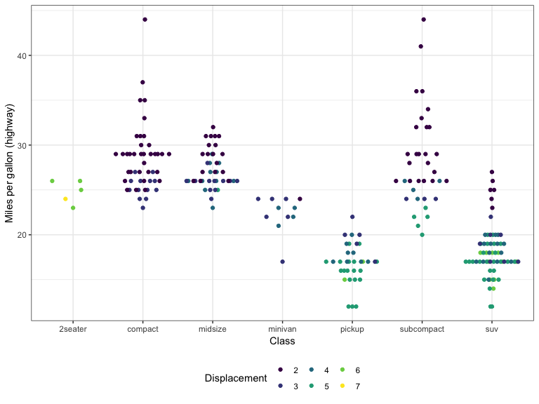

# Becoming the Critic. {data-background=#e8d725}


```r
vday <- params$day - 1
vlink <- paste0("http://www.perceptualedge.com/example", vday, ".php")
titlelink <- paste0('{data-background-iframe="', vlink, '"}')
```

## {data-background-iframe="http://www.perceptualedge.com/example5.php"}

[Visualization of the Day](http://www.perceptualedge.com/example5.php)


# Review {data-background=#e8d725}


## Case Study 3: Becoming a databender
> - [Case Study 3](https://byuistats.github.io/M335/weekly_projects/cs03_details.html)

*Take 10 minutes to brainstorm with your table what the data inputs are and what visualizations you would like to create?*

> - What mutations or summaries will you need to do?
> - What difficulties do you expect?
> - Do each of the task items make sense?


## Task 6: Developing a graphic
> - [Task 6](https://byuistats.github.io/M335/class_tasks/task06_details.html)


# Providing Critiques and the Routine {data-background=#e8d725}

## A few critique examples

* [Mckay's](https://github.com/BYUI335/Davis_M/issues/5):  Notice how he responds that he has addressed the issues.
* [Aletha's Request](https://github.com/BYUI335/Pyeatt_A/issues/5):  Notice her request and the responses.
* [Hathaway's Example Response](https://github.com/BYUI335/Pyeatt_A/issues/7): Notice the formatting and references.


# Displaying multiple distributions {data-background=#e8d725}

## Clarity vs. Complication

Data can get complicated very fast. How do we provide depth of variability understanding without overwhelming the visualization user?

> * [violin plots](http://eamoncaddigan.net/dataviz/r/psych/2015/09/26/violin-plots/)
> * [beeswarm plots](https://github.com/eclarke/ggbeeswarm)
> * [letter-value boxplots](https://github.com/hadley/lvplot)

Another package that makes flipping the axes easier in ggplot -- [rotating axes](https://github.com/lionel-/ggstance)

> * [link to last presentation](day_5.html#/displaying-distributions-of-multiple-groups-for-decision-making)

## Clarity vs. Complication (2)

> - What do we know after looking at this plot?
> **How do we provide depth of variability understanding without overwhelming the visualization user?**

```r
best_in_class <- mpg %>%
  group_by(class) %>%
  filter(row_number(desc(hwy)) == 1)
```


Remember, data can get complicated very fast. 


## Distribution background

* [violin plots](http://eamoncaddigan.net/dataviz/r/psych/2015/09/26/violin-plots/)
* [beeswarm plots](https://github.com/eclarke/ggbeeswarm)
* [letter-value box-plots](https://github.com/hadley/lvplot)
* Another package that makes flipping the axes easier in ggplot -- [rotating axes](https://github.com/lionel-/ggstance)


## Histograms (1)

<<<<<<< HEAD
What don't we like about this plot?


## Histograms (2)

* What changed in this histogram?
* What don't we like about this plot?
=======
> 1. Run this line of code below
> 2. Look at the errors (`problems(challenge)`), the `head()`, and `tail()` of your `challenge` object.  What formats should they be?
> 3. Now review [11.4.2 of our textbook](http://r4ds.had.co.nz/data-import.html#problems) and fix the read in.
>>>>>>> 3555fbbcd42e43308a527a106f7c819389108e06


<<<<<<< HEAD
## Boxplots
=======
```r
challenge <- read_csv(readr_example("challenge.csv"))
```

>>>>>>> 3555fbbcd42e43308a527a106f7c819389108e06

* What don't we like about this plot?
* How hard is it to explain?


## Violin plots

* What don't we like about this plot?
* How hard is it to explain?


## Beeswarm plots (1)

* What don't we like about this plot?
* How hard is it to explain?


## Beeswarm plots (1)

* What don't we like about this plot?
* How hard is it to explain?


## Letter-Value boxplots (1)

* What don't we like about this plot?
* How hard is it to explain?


## Letter-Value boxplots (2)

* What don't we like about this plot?
* How hard is it to explain?

<<<<<<< HEAD

=======
```r
library(ggrepel)
library(viridis)

best_in_class <- mpg %>% 
  group_by(class) %>% 
  filter(row_number(desc(hwy)) == 1)

ggplot(mpg, aes(displ, hwy)) +
  geom_point(aes(colour = class), size = 3) +
  geom_point(size = 1.5, data = best_in_class, color = "white") +
  geom_text_repel(aes(label = model, colour = class), 
                  data = best_in_class, show.legend = FALSE, 
                  nudge_x = -1, nudge_y = -2) +
  theme_bw() + theme(panel.grid.minor = element_blank()) +
  scale_color_viridis(discrete = TRUE) + 
  labs(x = "Engine displacement", y = "Miles per gallon (highway)", 
       color = "Vehicle type")
```
>>>>>>> 3555fbbcd42e43308a527a106f7c819389108e06

## Letter-Value boxplots (3)

* What don't we like about this plot?
* How hard is it to explain?


# Thursday Classes {data-background=#e8d725}


## Art Class

> - [What do you see?](images/sculpt.jpg){target="blank"}
> - [What about here?](images/sculpt_wide.jpg){target="blank"}

## The Wilderness of Data

<iframe width="860" height="515" src="https://www.youtube.com/embed/fTgvdTftXfI" frameborder="0" allow="autoplay; encrypted-media" allowfullscreen></iframe>


## Small Challenge

> - Use `geom_violin()` and `geom_quasirandom()` with the `ggplot2::mpg` data to show the mpg distribution by vehicle class.


## Thursday Task in class

<<<<<<< HEAD
> - I (or Cody) will work on this task with you in class for a large majority of the period.
> - 
=======
> * [link to last presentation](day_5.html#/displaying-distributions-of-multiple-groups-for-decision-making)

## Next Challenge


>>>>>>> 3555fbbcd42e43308a527a106f7c819389108e06
