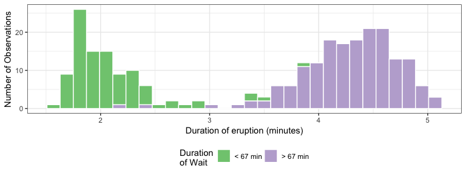
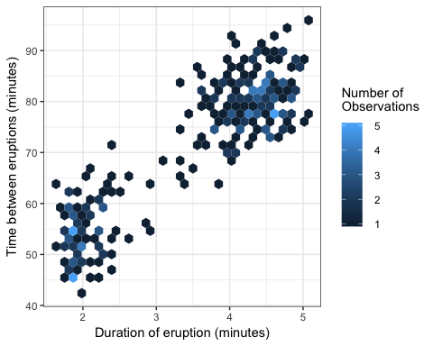

# Becoming the Critic.


```r
vday <- params$day - 1
vlink <- paste0("http://www.perceptualedge.com/example", vday, ".php")
titlelink <- paste0('{data-background-iframe="', vlink, '"}')
```

## {data-background-iframe="http://www.perceptualedge.com/example6.php"}

[Visualization of the Day](http://www.perceptualedge.com/example6.php)

## Great Quotes

> “There are no routine statistical questions, only questionable statistical routines.” 

— Sir David Cox

> “Far better an approximate answer to the right question, which is often vague, than an exact answer to the wrong question, which can always be made precise.” 

— John Tukey


# Team Discussion


## Case Study 3: Becoming a databender

> - The [Google spreadsheet link](https://docs.google.com/spreadsheets/d/1MQtkBWuxla9wITp0BzUTCjbmlvi9j9EiDLIXw7K3UBE/edit?usp=sharing)
> - [Case Study 3](https://byuistats.github.io/M335/weekly_projects/cs03_details.html)
> - [How did we do?](https://github.com/BYUI335/hathaway)


## Case Study 4: Reducing Gun Deaths (FiveThirtyEight)
> - [Case Study 4](https://byuistats.github.io/M335/weekly_projects/cs04_details.html)


## Task 7: World Data Investigations - Part 2
> - [Task 7](https://byuistats.github.io/M335/class_tasks/task07_details.html)


## Socrative Hours Quiz

[socrative.com](https://socrative.com)

## Your research questions

**[Task 4:](https://byuistats.github.io/M335/class_tasks/task04_details.html)**

> - Share your research question with your neighbor and explain why finding an answer to the question with data would be exciting.
> - Then we can discuss a few as a class.

# What is EDA?

## Exploratory Data Analysis

EDA is fundamentally a creative process. And like most creative processes, the key to asking quality questions is to generate a large quantity of questions.
 
> 1. What type of variation occurs within my variables?

> 2. What type of covariation occurs between my variables?

## Exploring Old Faithful goals

> 1. **Make the [histogram shown in the book](http://r4ds.had.co.nz/EDA_files/figure-html/unnamed-chunk-9-1.png) with the black and white theme and an improved x-axis label.**

## Exploring Old Faithful (1)


## Understanding `case_when()`

`case_when()` is particularly useful inside mutate when you want to create a new variable that relies on a complex combination of existing variables. **Write a short sentence that says what this code is doing?**


## Exploring Old Faithful goals

> 1. Make the [histogram shown in the book](http://r4ds.had.co.nz/EDA_files/figure-html/unnamed-chunk-9-1.png) with the black and white theme and an improved x-axis label.
> 2. **Use the mutate function to modify our plot to fill the histogram for two groups of waiting times.**


## Exploring Old Faithful (2)




## Exploring Old Faithful goals

> 1. Make the [histogram shown in the book](http://r4ds.had.co.nz/EDA_files/figure-html/unnamed-chunk-9-1.png) with the black and white theme and an improved x-axis label.
> 2. Use the mutate function to modify our plot to fill the histogram for two groups of waiting times.
> 3. **Use the waiting variable to make a hexbin plot of the relationship between waiting time and duration.**


## Exploring Old Faithful (3)



# Understanding terms

## Socrative Quiz

> - [Socrative: Exploratory Analysis](https://socrative.com/)


