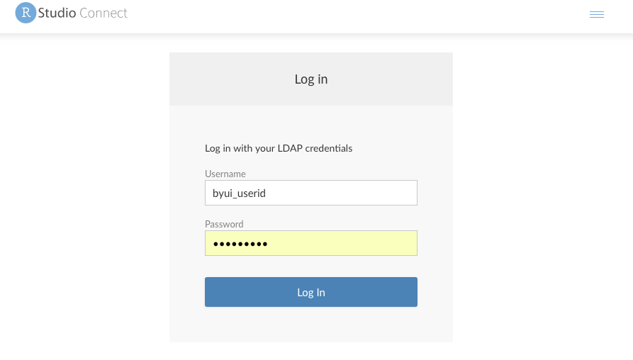
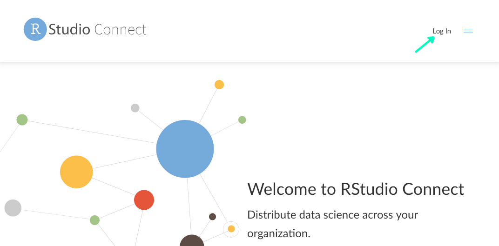

## BYU-I and RStudio Connect

R Studio has provided us with a professional version of their server tools to use within our BYU-I network.  After the first time getting connected the process should be painless.  We have included a couple of pictures and steps to get you connected.

### Login from link to file

1. Navigate to <https://shiny.byui.edu/connect/#/apps/343/access>
2. You should see a warning that says you don't have permission to access.  Click on the 'Log In' button at the center of the page.
3. After arriving at the 'Log in' screen you can type your byui id and password *(note that we have worked with IT to have this system within our network and use our login information)* and click 'Log In.'

 

4. You should now see an example project that was completed by a student.
5. Future links shared with you should open similarly.

### New Login from shiny.byui.edu

1. Navigate to <https://shiny.byui.edu>
2. Click the 'Log In' text in the upper right corner.

   
   
   
3. After arriving at the 'Log in' screen you can type your byui id and password *(note that we have worked with IT to have this system within our network and use our login information)* and click 'Log In.'

4. Upon logging in, you will see different reports (content) that is available to you.  Each content item can be restricted to specific users within the BYU-I network (note that a couple of classes teach students how to use the tool and have pushed material that you may see in your list).
