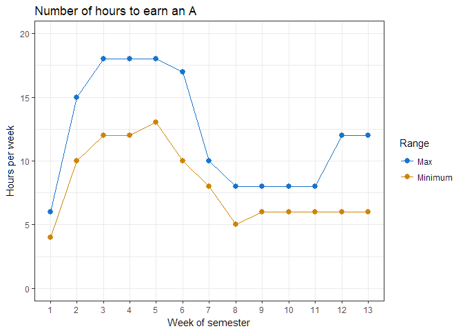
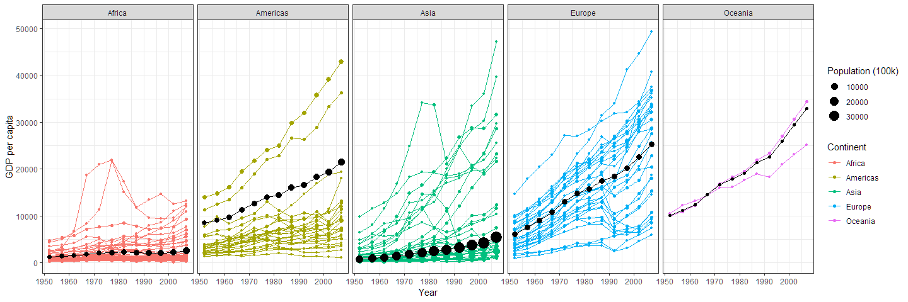

<!-- -->

## Case Study 2: Wealth and Life Expectancy (Gapminder) 
### Background 
<!-- https://github.com/jennybc/gapminder -->
[Hans Rosling](http://www.gapminder.org/news/sad-to-announce-hans-rosling-passed-away-this-morning/){target="blank"} is one of the most popular data scientists on the web. [His original TED talk](https://www.ted.com/talks/hans_rosling_shows_the_best_stats_you_ve_ever_seen){target="blank"} was very popular among my friends when it came out.  We are going to create some graphics using his formatted data as our weekly case study. Note that we need to remove Kuwait from the data ([discussion on this](https://github.com/jennybc/gapminder/issues/9){target="blank"})

 * [Homework Schedule](../homework_schedule.html)

### Reading

This reading will help you complete the tasks below.

* o [Chapter 3: R for Data Science - Data visualization](http://r4ds.had.co.nz/data-visualisation.html){target='blank'}
* o [Hans Rosling: The River of Myths](https://youtu.be/OwII-dwh-bk){target='blank'}

### Tasks

* [ ] Watch the [Hons Rosling video](https://www.ted.com/talks/hans_rosling_shows_the_best_stats_you_ve_ever_seen){target="blank"}
* [ ] Recreate the two graphics shown below using `gapminder` dataset from `library(gapminder)` (get them to match as closely as you can)
    * [ ] Use `library(ggplot2)` and the `theme_bw()` to duplicate the first plot
    * [ ] Use  `scale_y_continuous(trans = "sqrt")` to get the correct scale on the y-axis.
    * [ ] Build weighted average data set using  `weighted.mean()` and GDP with  `summarise()` and `group_by()` that will be the black continent average line on the second plot
    * [ ] Use `library(ggplot2)` and the `theme_bw()` to duplicate the second plot. You will need to use the new data to make the black lines and dots showing the continent average.
    * [ ] Use `ggsave()` and save each plot as a `.png` with a width of 15 inches
* [ ] Build an Rmd file that has the following features
    * [ ] The title is the same as listed in the task
    * [ ] You have two sections -- 1) Background, 2) Images
    * [ ] In the background section write a few sentences about what you learned making these plots
    * [ ] In the Image section have two chunks.  One for each image
* [ ] Save your `.Rmd', `.md`, and the two `.png`'s of the plots into your git repository.

### Plots

<!-- --><!-- -->

