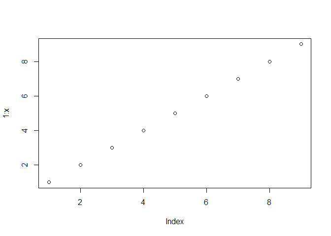

<!-- -->

## Case Study 11: Interacting with space 
### Background 

You can recreate [CS 10](https://byuistats.github.io/M335/weekly_projects/cs10_details.html){target="blank"} or find your own spatial data to display using [leaflet](http://rstudio.github.io/leaflet/
){target="blank"}.

 * [Homework Schedule](../homework_schedule.html)

### Reading

This reading will help you complete the tasks below.

* o [Leaflet for R: Introduction](http://rstudio.github.io/leaflet/){target='blank'}

### Tasks

* [ ] Choose an option of recreating or using new data.
    * [ ] Recreate [CS 10](https://byuistats.github.io/M335/weekly_projects/cs10_details.html){target="blank"} tasks with leaflet
    * [ ] Find your own spatial data that interests you and build a visualization
* [ ] Create an `.Rmd` file with 1-2 paragraphs summarizing your graphics and the choices you made in your visualization
* [ ] Compile your `.md` and `.html` file into your git repository
* [ ] Find two other student's compiled files in their repository and provide feedback using the issues feature in GitHub (If they already have three issues find a different student to critique)
* [ ] Address 1-2 of the issues posted on your project and push the updates to GitHub

